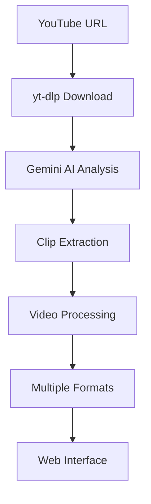

# Viral Clip AI 🤖🎥✂️<br><sup>AI-powered viral clip extractor for YouTube commentary videos</sup></h1>

[](https://python.org)
[](https://fastapi.tiangolo.com)
[](https://ai.google.dev)
[](LICENSE)

## 🚀 Overview

Viral Clip AI is an intelligent web application that leverages Google's Gemini AI to automatically extract viral-worthy clips from long-form commentary videos. It is designed as a SaaS-style platform with a modern Next.js frontend, a FastAPI backend, secure multi-tenancy, and Cloudflare R2 as primary storage.

### ✨ Key Features

- **🤖 AI-Powered Analysis**: Uses Gemini AI to identify viral moments in videos
- **🎯 Smart Segmentation**: Extracts 20-60 second clips following proven "Call & Response" formulas
- **📱 Real-Time Processing**: WebSocket-powered progress updates
- **🎨 Multiple Output Styles**: Generate clips in split-view, left-focus, right-focus, or all variations
- **⬇️ One-Click Downloads**: Download processed clips with metadata
- **📋 Copy-Paste Ready**: Includes optimized titles and social media captions
- **🔄 Web-Based Interface**: Clean, modern UI built with Next.js App Router + TailwindCSS
- **🔐 SaaS-Ready**: Firebase Auth, Firestore, and per-user clip history
- **☁️ Cloud Storage**: Cloudflare R2 (S3-compatible) as primary clip storage
- **🧠 Custom Prompts**: Per-job and global prompts to steer Gemini’s behavior

## 🏗️ Architecture



### Tech Stack

- **Backend**: FastAPI (Python async web framework)
- **AI Engine**: Google Gemini AI
- **Video Processing**: yt-dlp + ffmpeg
- **Real-Time**: WebSockets for live updates
- **Frontend**: Next.js (App Router) + React + TailwindCSS
- **Storage**: Cloudflare R2 (S3-compatible) with presigned URLs
- **Auth & Data**: Firebase Auth + Firestore
- **Server**: Uvicorn / Gunicorn (via Docker)

## 📋 Prerequisites

- Docker and Docker Compose (recommended for both dev and prod)
- Google AI API key (Gemini)
- Firebase project with:
  - Service account JSON for Admin SDK
  - Web config for frontend

You can still run things directly with Python/Node if you prefer, but the
default path is Docker-based.

## 🛠️ Local Development (Docker)

See **`DOCKER_SETUP.md`** for a detailed quickstart. In short:

1. **Clone the repository**

   ```bash
   git clone https://github.com/vmatresu/viralclipai.git
   cd viralclipai
   ```

2. **Create env files**

   - Copy `.env.api.dev.example` → `.env.api.dev` and fill in values.
   - Copy `web/.env.local.example` → `web/.env.local` and fill in values.

3. **Place Firebase credentials**

   - Place `firebase-credentials.json` in the project root.
   - Point `FIREBASE_CREDENTIALS_PATH` in `.env.api.dev` to `/app/firebase-credentials.json` (for Docker).

4. **Run the stack**

   ```bash
   docker-compose -f docker-compose.dev.yml up --build
   ```

   - Backend API: http://localhost:8000
   - Frontend: http://localhost:3000
   - API docs: http://localhost:8000/docs

### Optional: Running without Docker

For advanced/local debugging you can still:

```bash
python -m venv venv
source venv/bin/activate
pip install -r requirements.txt
export GEMINI_API_KEY=...
python -m app.main
```

and run the Next.js app from `web/` with `npm install` and `npm run dev`.

## 🔒 Code Quality & Commit Gating

This project enforces strict code quality standards through automated commit gating:

### Pre-commit Checks

All commits automatically run the following validations:

- **TypeScript Type Checking**: Ensures type safety and no compilation errors
- **ESLint Linting**: Code style, consistency, and quality checks
- **Build Validation**: Ensures the Next.js application builds successfully

### Development Workflow

```bash
# Install dependencies (automatically sets up commit hooks)
npm install

# Run quality checks manually
npm run check          # All checks
npm run type-check     # TypeScript only
npm run lint          # ESLint only
npm run build         # Build only
```

If any check fails, the commit is blocked. See `web/COMMIT_GATING.md` for detailed information.

## 🎯 Usage

1. **Input YouTube URL**: Paste any YouTube video URL in the input field
2. **Select Output Style**:
   - **Split View**: Traditional top/bottom layout
   - **Left Focus**: Full height left side, smaller right
   - **Right Focus**: Full height right side, smaller left
   - **All Styles**: Generate all three variations
3. **Launch Processor**: Click the rocket button to start AI analysis
4. **Monitor Progress**: Watch real-time logs and progress bar
5. **Download Results**: Get your viral clips with optimized metadata

### Example Workflow

```bash

# Development (M1 Mac)
cp .env.dev.example .env.dev
# Add your firebase-credentials.json
docker compose -f docker-compose.dev.yml up --build

# Production build (for Ubuntu AMD64)
docker buildx build --platform linux/amd64 -t viralclipai-api:latest --target api-runtime .
docker buildx build --platform linux/amd64 -t viralclipai-worker:latest --target worker-runtime .

# Open http://localhost:3000
# Paste: https://www.youtube.com/watch?v=example
# Optionally add a custom prompt
# Select style and process
```

## 🔧 Configuration

The application is structured as a multi-tenant SaaS with Firebase Auth,
Firestore, and Cloudflare R2-based storage (S3-compatible). Most behaviour is controlled via
environment variables (see `app/config.py` and `docs/configuration.md`).

**Core settings**

- **Gemini API**

  - `GEMINI_API_KEY` – API key for Google Gemini, used by `app/core/gemini.py`.

- **Firebase Admin / Firestore (backend)**

  - `FIREBASE_PROJECT_ID` – Firebase project ID.
  - `FIREBASE_CREDENTIALS_PATH` – path to a service account JSON file with
    Firestore access.

- **Firebase Web SDK (frontend)**

  - `NEXT_PUBLIC_FIREBASE_API_KEY`
  - `NEXT_PUBLIC_FIREBASE_AUTH_DOMAIN`
  - `NEXT_PUBLIC_FIREBASE_PROJECT_ID`
  - `NEXT_PUBLIC_FIREBASE_STORAGE_BUCKET`
  - `NEXT_PUBLIC_FIREBASE_MESSAGING_SENDER_ID`
  - `NEXT_PUBLIC_FIREBASE_APP_ID`
  - `NEXT_PUBLIC_FIREBASE_MEASUREMENT_ID` (optional, for Analytics)

- **Cloudflare R2 (clip storage)**

  - `R2_ACCOUNT_ID` – Cloudflare account ID used for R2.
  - `R2_BUCKET_NAME` – bucket where clips, thumbnails, and highlights are stored.
  - `R2_ACCESS_KEY_ID` / `R2_SECRET_ACCESS_KEY` – R2 API tokens (S3-compatible).
  - `R2_ENDPOINT_URL` – S3 endpoint for R2. If omitted, defaults to
    `https://<R2_ACCOUNT_ID>.r2.cloudflarestorage.com`.
  - R2 is fronted by Cloudflare's global network and has zero egress fees,
    which is ideal for a video-heavy SaaS.

- **TikTok API**

  - `TIKTOK_API_BASE_URL` – URL of the TikTok upload endpoint you expose
    (or proxy) from your TikTok developer integration.

- **Security / domains**
  - `ALLOWED_HOSTS` – comma-separated list of hostnames allowed at the
    FastAPI layer (used by TrustedHostMiddleware). Recommended for
    production:
    - `ALLOWED_HOSTS=viralvideoai.io,www.viralvideoai.io`
  - `CORS_ORIGINS` – comma-separated list of allowed origins for browsers.
    For example:
    - `CORS_ORIGINS=https://viralvideoai.io,https://www.viralvideoai.io`

**Paths and logging**

- **Video scratch directory**: `./videos/`
  - Used as a temporary working directory while processing.
  - Final clips and thumbnails are uploaded to Cloudflare R2 under
    `users/{uid}/{run_id}/clips/...` and are served via S3-compatible
    presigned URLs.
- **Prompt template**: `./prompt.txt` (local fallback). The primary base prompt
  is now stored in Firestore under `admin/config.base_prompt`. See
  `docs/prompts.md`.
- **Logging**: Rotating file logs (default `logs/app.log`) plus console logs.
  See `docs/logging-and-observability.md`.

## 🌐 SaaS Auth & Multi-Tenancy

- Authentication is handled entirely by **Firebase Auth** on the frontend.
  The browser obtains a Firebase ID token and sends it to the backend via
  WebSocket (`/ws/process`) and `Authorization: Bearer <token>` headers.
- The backend verifies ID tokens with **Firebase Admin** and stores per-user
  data in **Firestore** under `users/{uid}` and `users/{uid}/videos/{run_id}`.
- All clips and thumbnails are stored in **Cloudflare R2** (S3-compatible)
  namespaced by user ID and run ID. Access is always via short-lived
  **presigned URLs** generated against the R2 S3 API.
- Each user is assigned a plan (`free`, `pro`, etc.) and monthly clip limits
  are enforced before processing starts.

## 🤝 Contributing

We welcome contributions! Here's how you can help:

1. **Fork the repository**
2. **Create a feature branch**: `git checkout -b feature/amazing-feature`
3. **Make your changes** and add tests
4. **Commit your changes**: `git commit -m 'Add amazing feature'`
5. **Push to the branch**: `git push origin feature/amazing-feature`
6. **Open a Pull Request**

### Development Guidelines

- Follow PEP 8 style guidelines
- Add docstrings to new functions
- Update tests for new features
- Ensure all tests pass before submitting PR

## 📝 AI Prompt Customization

Prompting is now first-class and multi-layered. See `docs/prompts.md` for
full details. In summary:

- Users can provide a **per-job custom prompt** from the main UI.
- Admins can define a **global base prompt** in Firestore via `/admin/prompt`.
- `prompt.txt` acts as a **fallback** when no global prompt is set.
- The prompt used for each job is stored alongside metadata and surfaced
  in both the results view and the history page.

## 🐛 Troubleshooting

### Common Issues

**"Gemini API key not found"**

- Ensure `GEMINI_API_KEY` environment variable is set
- Check your Google AI Studio account for API access

**"Video download failed"**

- Verify YouTube URL is valid and accessible
- Check yt-dlp is installed: `pip install yt-dlp`

**"Processing timeout"**

- Long videos may take time; check logs for progress
- Consider shorter video segments for testing

**"Port already in use"**

- Change port: `uvicorn app.main:app --port 8001`

## 📄 License

This project is licensed under the MIT License - see the [LICENSE](LICENSE) file for details.

## 🙏 Acknowledgments

- **Google Gemini AI** for powering the intelligent analysis
- **FastAPI** for the robust async web framework
- **yt-dlp** for reliable YouTube video handling
- **TailwindCSS** for beautiful, responsive UI

## 📞 Support

- **Issues**: [GitHub Issues](https://github.com/vmatresu/viralclipai/issues)
- **Discussions**: [GitHub Discussions](https://github.com/vmatresu/viralclipai/discussions)
- **Email**: Contact through GitHub

---

<div align="center">
  <p><strong>Made with ❤️ for content creators</strong></p>
  <p>Transform your commentary videos into viral sensations!</p>
</div>
