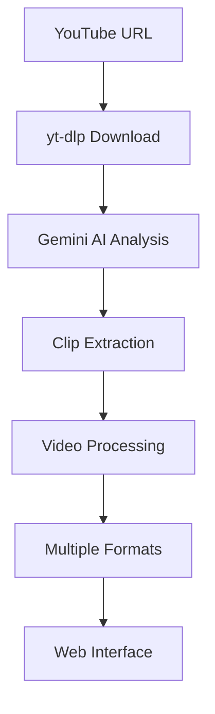

# Viral Clip AI 🤖🎥✂️<br><sup>AI-powered viral clip extractor for YouTube commentary videos</sup></h1>

[](https://python.org)
[](https://fastapi.tiangolo.com)
[](https://ai.google.dev)
[](LICENSE)

## 🚀 Overview

Viral Clip AI is an intelligent web application that leverages Google's Gemini AI to automatically extract viral-worthy clips from YouTube commentary videos. Perfect for content creators who produce split-screen reaction videos, this tool identifies high-engagement segments using advanced AI analysis.

### ✨ Key Features

- **🤖 AI-Powered Analysis**: Uses Gemini AI to identify viral moments in videos
- **🎯 Smart Segmentation**: Extracts 20-60 second clips following proven "Call & Response" formulas
- **📱 Real-Time Processing**: WebSocket-powered progress updates and live console logs
- **🎨 Multiple Output Styles**: Generate clips in split-view, left-focus, right-focus, or all variations
- **⬇️ One-Click Downloads**: Download processed clips with metadata
- **📋 Copy-Paste Ready**: Includes optimized titles and social media captions
- **🔄 Web-Based Interface**: Clean, modern UI built with TailwindCSS

## 🏗️ Architecture



### Tech Stack

- **Backend**: FastAPI (Python async web framework)
- **AI Engine**: Google Gemini AI
- **Video Processing**: yt-dlp (YouTube downloader)
- **Real-Time**: WebSockets for live updates
- **Frontend**: Jinja2 templates + TailwindCSS
- **Server**: Uvicorn ASGI server

## 📋 Prerequisites

- Python 3.8+
- Google AI API key (for Gemini)
- FFmpeg (for video processing)

## 🛠️ Installation

1. **Clone the repository**

   ```bash
   git clone https://github.com/vmatresu/viralclipai.git
   cd viralclipai
   ```

2. **Create virtual environment**

   ```bash
   python -m venv venv
   source venv/bin/activate  # On Windows: venv\Scripts\activate
   ```

3. **Install dependencies**

   ```bash
   pip install -r requirements.txt
   ```

4. **Set up environment variables**

   ```bash
   export GEMINI_API_KEY="your-gemini-api-key-here"
   # On Windows: set GEMINI_API_KEY=your-gemini-api-key-here
   ```

5. **Run the application**

   ```bash
   python -m app.main
   # Or: uvicorn app.main:app --host 0.0.0.0 --port 8000 --reload
   ```

6. **Open in browser**

   Navigate to `http://localhost:8000`

## 🎯 Usage

1. **Input YouTube URL**: Paste any YouTube video URL in the input field
2. **Select Output Style**:
   - **Split View**: Traditional top/bottom layout
   - **Left Focus**: Full height left side, smaller right
   - **Right Focus**: Full height right side, smaller left
   - **All Styles**: Generate all three variations
3. **Launch Processor**: Click the rocket button to start AI analysis
4. **Monitor Progress**: Watch real-time logs and progress bar
5. **Download Results**: Get your viral clips with optimized metadata

### Example Workflow

```bash
# Start the server
python -m app.main

# Open http://localhost:8000
# Paste: https://www.youtube.com/watch?v=example
# Select style and process
```

## 🔧 Configuration

The application is now structured as a multi-tenant SaaS with Firebase Auth,
Firestore, and S3-based storage. Most behaviour is controlled via
environment variables (see `app/config.py`).

**Core settings**

- **Gemini API**

  - `GEMINI_API_KEY` – API key for Google Gemini, used by `app/core/gemini.py`.

- **Firebase Admin / Firestore (backend)**

  - `FIREBASE_PROJECT_ID` – Firebase project ID.
  - `FIREBASE_CREDENTIALS_PATH` – path to a service account JSON file with
    Firestore access.

- **Firebase Web SDK (frontend)**

  - `FIREBASE_WEB_API_KEY`
  - `FIREBASE_WEB_AUTH_DOMAIN`
  - `FIREBASE_WEB_PROJECT_ID`
  - `FIREBASE_WEB_STORAGE_BUCKET`
  - `FIREBASE_WEB_MESSAGING_SENDER_ID`
  - `FIREBASE_WEB_APP_ID`

- **AWS / S3 (clip storage)**

  - `AWS_REGION` – AWS region for the S3 bucket (e.g. `us-east-1`).
  - `S3_BUCKET_NAME` – name of the bucket where clips and thumbnails are stored.
  - Standard AWS credentials for boto3 must also be configured, e.g. via
    `AWS_ACCESS_KEY_ID`, `AWS_SECRET_ACCESS_KEY`, and optionally
    `AWS_SESSION_TOKEN`/`AWS_PROFILE`.

- **TikTok API**
  - `TIKTOK_API_BASE_URL` – URL of the TikTok upload endpoint you expose
    (or proxy) from your TikTok developer integration.

**Paths and logging**

- **Video scratch directory**: `./videos/`
  - Used as a temporary working directory while processing.
  - Final clips and thumbnails are uploaded to S3 under
    `users/{uid}/{run_id}/clips/...` and are served via presigned URLs.
- **Prompt template**: `./prompt.txt` (customizable AI instructions).
- **Logging**: Debug logs saved to `debug.log`.
- **Templates**: Jinja2 templates in `app/templates/`.

## 🌐 SaaS Auth & Multi-Tenancy

- Authentication is handled entirely by **Firebase Auth** on the frontend.
  The browser obtains a Firebase ID token and sends it to the backend via
  WebSocket (`/ws/process`) and `Authorization: Bearer <token>` headers.
- The backend verifies ID tokens with **Firebase Admin** and stores per-user
  data in **Firestore** under `users/{uid}` and `users/{uid}/videos/{run_id}`.
- All clips and thumbnails are stored in **S3** namespaced by user ID and
  run ID. Access is always via short-lived **presigned URLs**.
- Each user is assigned a plan (`free`, `pro`, etc.) and monthly clip limits
  are enforced before processing starts.

## 🤝 Contributing

We welcome contributions! Here's how you can help:

1. **Fork the repository**
2. **Create a feature branch**: `git checkout -b feature/amazing-feature`
3. **Make your changes** and add tests
4. **Commit your changes**: `git commit -m 'Add amazing feature'`
5. **Push to the branch**: `git push origin feature/amazing-feature`
6. **Open a Pull Request**

### Development Guidelines

- Follow PEP 8 style guidelines
- Add docstrings to new functions
- Update tests for new features
- Ensure all tests pass before submitting PR

## 📝 AI Prompt Customization

The AI behavior is controlled by the `prompt.txt` file. You can customize:

- Target audience and content style
- Clip length and structure preferences
- Engagement optimization parameters
- Output format specifications

## 🐛 Troubleshooting

### Common Issues

**"Gemini API key not found"**

- Ensure `GOOGLE_API_KEY` environment variable is set
- Check your Google AI Studio account for API access

**"Video download failed"**

- Verify YouTube URL is valid and accessible
- Check yt-dlp is installed: `pip install yt-dlp`

**"Processing timeout"**

- Long videos may take time; check logs for progress
- Consider shorter video segments for testing

**"Port already in use"**

- Change port: `uvicorn app.main:app --port 8001`

## 📄 License

This project is licensed under the MIT License - see the [LICENSE](LICENSE) file for details.

## 🙏 Acknowledgments

- **Google Gemini AI** for powering the intelligent analysis
- **FastAPI** for the robust async web framework
- **yt-dlp** for reliable YouTube video handling
- **TailwindCSS** for beautiful, responsive UI

## 📞 Support

- **Issues**: [GitHub Issues](https://github.com/vmatresu/viralclipai/issues)
- **Discussions**: [GitHub Discussions](https://github.com/vmatresu/viralclipai/discussions)
- **Email**: Contact through GitHub

---

<div align="center">
  <p><strong>Made with ❤️ for content creators</strong></p>
  <p>Transform your commentary videos into viral sensations!</p>
</div>
